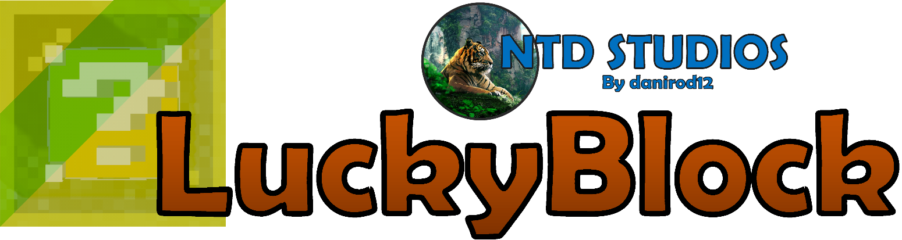

<h1 align="center">
   
  
   
</h1>

<h4 align="center">Source code of the LuckyBlock NTD spigot plugin, made with love in Java.</h4>

    
    
    
    
    

## Plugin Wiki

You can find setup info and languages list on plugin Wiki.
[Click to visit plugin wiki](https://danirod12.github.io/ntd-wiki/docs/luckyblock/overview/)\
If you want to make a contribution to the wiki, you can do so in [NTD Wiki repo](https://github.com/danirod12/ntd-wiki)

## What is it?

LuckyBlock NTD is a Minecraft plugin that brings a modern, resource-pack-free Lucky Block experience to
your server. Unlike traditional implementations that rely on sponges, it uses a clean glass-container design visible
to all players out of the box. The plugin supports versions 1.8 through latest and offers unique overlay styles,
special drop effects, and powerful API for minigame development. With a focus on performance and customization,
LuckyBlock NTD is perfect for both casual servers and competitive minigames like BedWars

## Features

- 18 default lucky block colors including Tinted and Iced variants
- No resource pack required - all players see lucky blocks without any client-side setup
- Modern unique glass-container block style similar to Hypixel's design
- Special drop effects: Lucky Bow, TNT, Cobweb, Triple Arrow, Pig Wall, Lightning, and more
- Full NBT item support with Oraxen, ItemsAdder, MMOItems, MythicMobs, and other custom. Even on Mohist
- Multi-language support (Full list could be found on the wiki)
- Powerful API for minigame development
- Native integration with BedWars1058 and MBedwars (premium)
- Mineable addon - lucky blocks can drop from ore and block mining (premium)
- Built-in GUI editor for real-time config changes without editing files (premium)
- And much more!

## Contributing
If you want to contribute to LuckyBlock NTD, you can do so by creating a pull request to `main` branch.\
1. Fork LuckyBlock NTD on GitHub
2. Clone your forked repository (`git clone`)
3. Create your feature branch (`git checkout -b my-feature`)
4. Commit your changes (`git commit -am 'Add my feature'`)
5. Push to the branch (`git push origin my-feature`)
6. Create a new Pull Request to the `main` branch
7. Wait for your pull request to be reviewed and merged
8. Celebrate your contribution!

## License

*Click here to read [the entire license](https://github.com/danirod12/LuckyBlockNTD/blob/master/LICENSE.md).*
